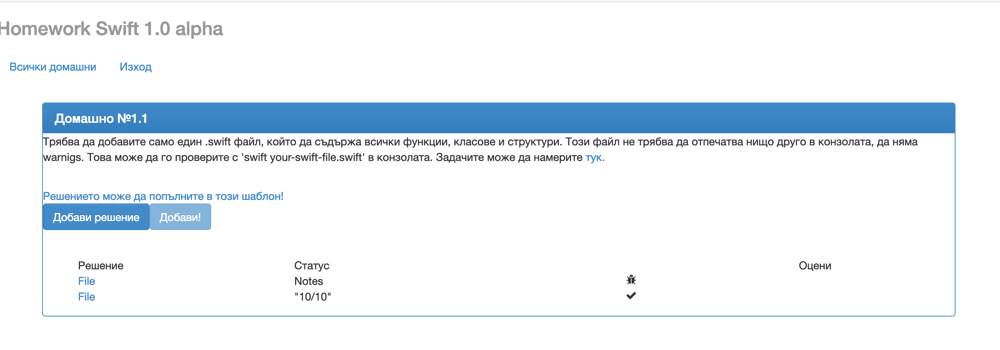

## Първото задание за самостоятелна домашна работа

Решениятo на всяка задача ще трябва да качите в нашия портал на следния адрес - [http://swiftfmi.apposestudio.com/](http://swiftfmi.apposestudio.com/register)

Всеки __ТРЯБВА__ да се регистрира с факултетния си номер.


За всяка задача, ще имате определена страница, където ще може да видите колко точки получавате.



Трябва да свалите шаблона и да попълните решението в него. Не оставяйте ненужни `print` извиквания във вашето решение. Системата няма да може да оцени некоректни решения и ще покаже съответната икона.


Ако имате някакви въпроси за системата, моля пишете на имейла за контакт.

Крайният срок за качване на решенията е _07.04.2019_!


## Задачи:

1. Да се напише функция, която декодира символен низ, като се знае, че е използвана следната техника на кодиране. Кодирането става чрез отместване и съпоставяне на буквите на други. Примерно: Кодиране с отместване 2 се реализира по следния начин.

		a -> c, b -> d, c -> e.
		
Следователно, `abc` ще се кодира като `cde`. Съответно функцията трябва при извикване да дава правилния отговор.

		print(decode(in: "cde", code: 2)) 
		//отпечатва abc

		func decode(in:String, code: Int ) -> String {
		
		}

2. Да се нaпише функция, която пресмята стойността на прост математически израз от вида, подаден като String:
	
	__Скобите ще са винати налични и изразът ще е коректен!__
	
	Пример: 
		
		((23 + 6) * 2)
	
	Възможните операции са ```^(степенуване), *, /,  +, - ```.
	
		func evaluate(expression: String) -> Double {
			//TODO: your implementation goes here
		}

3. Да се напише функция, която намира броят на различните пътища в лабиринт, зададен в двумерен масив (матрица). Ако няма път, да връща ```0```.

	_Препоръчително е да се използват помощни функции и структури._
 
	Пример: 
		
		^ 0 0 0 0 0 0 1
		0 1 1 1 1 1 0 0
		0 0 0 0 0 1 1 1
		0 1 1 1 0 1 0 0
		0 1 0 1 0 0 0 1
		0 0 0 1 0 1 0 *

	Където:
	
		0 е проходимо поле
		1 е непроходимо поле
		^ е началната позиция
		* е крайната позиция


	Примeрна функция:

		func findPaths(in: [[String]]) -> Int {
			//TODO: your implementation goes here
		}

